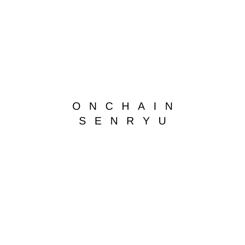

[](https://github.com/susumutomita/2024-Superhack/actions/workflows/contract_ci.yml)


# Onchain Senryu

ETH Global Link: [Onchain Senryu Showcase](https://ethglobal.com/showcase/onchain-senryu-sfbo5)

<div style="text-align: center;">
  
</div>

**Onchain Senryu** is a unique platform that merges the traditional Japanese art of senryu (a form of haiku) with the cutting-edge technology of blockchain. Users can create, share, and vote on senryu poems, all while ensuring authenticity and transparency through the use of smart contracts on the Base blockchain.

## Table of Contents

- [Onchain Senryu](#onchain-senryu)
  - [Table of Contents](#table-of-contents)
  - [Introduction](#introduction)
  - [Features](#features)
  - [Technologies Used](#technologies-used)
  - [Images](#images)
  - [System Overview](#system-overview)
  - [Screenshots](#screenshots)
  - [Installation](#installation)
  - [Usage](#usage)
  - [Future Prospects](#future-prospects)
  - [Contributing](#contributing)
  - [License](#license)
  - [The Team](#the-team)

## Introduction

**Onchain Senryu** is a decentralized application (dApp) that allows users to engage with the traditional Japanese art form of senryu. Users can create senryu poems with the help of AI, submit their creations to the blockchain for permanent record, and participate in a community-driven voting process to rank the best senryu. This platform ensures the authenticity of each senryu and leverages the transparency and immutability of blockchain technology.

## Features

- **AI-Assisted Senryu Creation**: Generate senryu poems with the help of AI by providing a prompt or theme.
- **Blockchain-Backed Submission**: Permanently submit your senryu to the Base blockchain, ensuring authenticity and ownership.
- **Community Voting**: Participate in voting on your favorite senryu, with results recorded on the blockchain for transparency.
- **World ID Integration**: Secure user authentication and bot prevention using World ID.

## Technologies Used

- **Blockchain Platform**: Base
- **Smart Contracts**: Solidity
- **Front-end**: Next.js
- **AI Integration**: Groq API for AI-generated senryu
- **Authentication**: World ID

## Images

<div style="text-align: center;">
  
</div>

## System Overview

**Onchain Senryu** consists of a front-end built with Next.js and a blockchain back-end powered by Foundry. The system leverages smart contracts on the Base blockchain to handle senryu submissions and voting. AI integration through the Groq API allows users to generate senryu with ease. This decentralized approach ensures that every poem is verifiable and immutable, preserving the art form for future generations.

## Screenshots

<div style="text-align: center;">
  
</div>

## Installation

1. **Clone the repository**:

   ```bash
   git clone https://github.com/susumutomita/2024-Superhack
   cd 2024-Superhack
   ```

2. **Install dependencies**:

   ```bash
   make install_all
   ```

3. **Set up environment variables**:
   Set environment variables below

   ```plaintext
   NEXT_PUBLIC_WLD_APP_ID=<Your World ID App ID>
   NEXT_PUBLIC_WLD_ACTION=<Your World ID Action>
   GROQ_API_KEY=<Groq API key>
   ```

4. **Run the development server**:
   ```bash
   make start
   ```

## Usage

- Open your browser and navigate to `http://localhost:3000`.
- Create senryu poems, submit them to the blockchain, and vote on your favorites in the community.

## Future Prospects

- **Multilingual Support**: Expand the platform to support senryu creation and interaction in multiple languages.
- **Enhanced AI Features**: Integrate more advanced AI capabilities to offer users deeper insights and creative options for senryu creation.
- **Visual Content Integration**: Add the ability to attach images or videos to senryu, enhancing the overall experience.
- **Global Competitions**: Host international senryu competitions with rewards and recognition.

## Contributing

We welcome contributions to Onchain Senryu. Please fork the repository and submit pull requests for review. For major changes, please open an issue first to discuss what you would like to change.

## License

This project is licensed under the MIT License. See the [LICENSE](LICENSE) file for details.

## The Team

- [Susumu Tomita](https://susumutomita.netlify.app/) - Full Stack Developer
